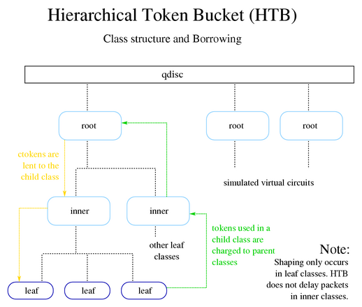
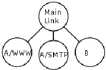
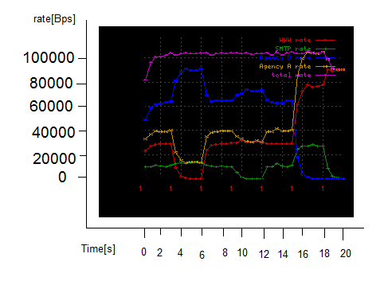
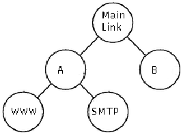
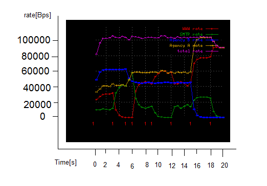
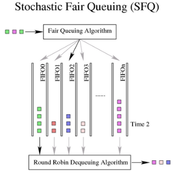
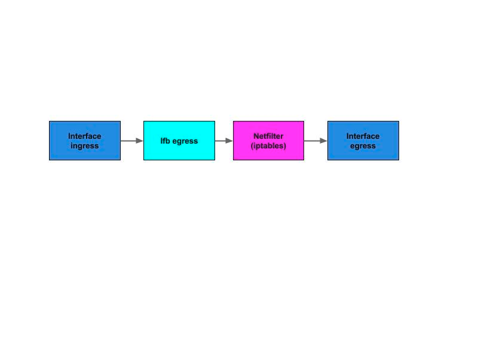

مقدمه
===============================

در لینوکس برای هر اینترفیس مفهومی با عنوان Queue Discipline مطرح می شود،
الگوریتم هایی که نحوه رفتار با بسته های صف شده را معرفی می کند. این
الگوریتم ها دو دسته هستند:

-   Classless QDiscs: sfq, fq\_codel, tbf, red

-   Classful QDiscs: HTB, HFSC, PRIO , QFQ 

حالت ساده و پیش فرض Queue Discipline در لینوکس برای کلیه اینترفیس ها مدل
FIFO است. بدین معنی که در حالت پیش فرض لینوکس هیچ‌گونه کنترل و تاخیر در
پهنای باند و دریافت و ارسال بسته ها اعمال نمی‌کند. هر کدام از این
الگوریتم ها دارای خصوصیاتی هستند که بایستی با توجه به موقعیت مورد نظر
مورد استفاده قرار گیرند. برای مثال در جایی که فقط اولویت ترافیک مهم است
و نیازی به کنترل محدوده های پهنای باند نیست، بهتر است از الگوریتم PRIO
استفاده شود.

برخی از QDisc ها می توانند شامل کلاس هایی باشند که خود دارای  QDisc هایی
هستند. این کلاس ها می توانند شامل محدودیت های پهنای باند و یا اولویت
باشند. برای اینکه بتوان ترافیک مورد نظر را به کلاس ترافیکی مربوط به آن
ارسال کنیم بایستی از فیلترها استفاده کنیم. زمانی که ترافیک به یک کلاس می
رسد، تمامی فیلترهای متصل به آن صدا زده می شوند و فیلتر مربوطه ترافیک را
به کلاس مشخص شده ارسال می کند. در tc فیلترهای مختلفی مانند fw، flow، u32
ارائه شده است.

نکته این که tc می تواند روی ترافیک خروجی از اینترفیس (egress) کنترل
پهنای باند انجام دهد. به منظور این که بتوان روی ترافیک ورودی به اینترفیس
(ingress) نیز پهنای باند را کنترل کرد می توان از اینترفیسی مجازی با نام
ifb استفاده کرد.
برای اطلاعات بیشتر لینک های زیر را مطالعه کنید.

[https://wiki.linuxfoundation.org/networking/ifb]

[https://www.google.com/url?q=https://wiki.linuxfoundation.org/networking/ifb&sa=D&ust=1537799960453000]

نیازمندی های نارین 
==================
-   اولویت بندی ترافیک
-   اعمال محدودیت پهنای باند برای شبکه ها، کاربران، گروه ها و سرویس ها
-   اعمال زمان بندی برای سیاست های کنترل پهنای باند
-   اولویت بندی سیاست های کنترل پهنای باند

کنترل پهنای باند در نارین 
=========================

با توجه به نیازمندی های کنترل پهنای باند در نارین:
-   الگوریتم HTB برای کلاس بندی ترافیک
-   الگوریتم SFQ برای مدیریت qdisc های هر کلاس
-   ماژول ifb برای کنترل پهنای باند دانلود
-   فیلتر fw
-   iptables برای نشان گذاری ترافیک

الگوریتم HTB 
------------

با این الگوریتم می توان پهنای باند را به کلاس های مختلف (در یک ساختار
درختی) دسته بندی کرد.
 
 
                  
### مثالی از قرض دهی پهنای باند در HTB 
مثال: در این مثال دو کاربر با نام A و B وجود دارد که هر دو از واسط eth0
برای اتصال به اینترنت استفاده می‌کنند. به کاربر B مقدار پهنای باند
60کیلوبیت و به کاربرA مقدار پهنای باند40 کیلوبیت تخصیص می‌دهیم. از پهنای
باند کنارگذاشته شده برای کاربرA مقدار 30کیلوبیت آن را برای استفاده از
www و بقیه آن را برای مصارف دیگر تعریف می‌نماییم.

در این الگوریتم اگر کلاسی کمتر از مقدار پهنای تعریف شده برای آن را تقاضا
کند بقیه کلاس‌ها می‌توانند از پهنای باند اضافی آن استفاده نمایند.
در مثال بالا ابتدا باید یک صف کلی برای واسط شبکه تعریف نماییم که
یسته‌های ورودی در این صف کلی ذخیره می‌شوند. اسم این صف کلی را handle1
می‌گذاریم. این نام برای این است که زمانی که می‌خواهیم زیرمجموعه‌هایی به
این صف اضافه کنیم باید بتوانیم آن‌ها را به این صف کلی نسبت دهیم. قابل
ذکر است که نوشتن نام به صورت x:y می‌باشد که x یک عدد صحیح است کهqdisc را
مشخص می‌کند و y یک عدد صحیح است که مشخص کننده‌ی کلاسی است که qdisc به آن
تعلق دارد بنابراین چون qdisc اولیه به کلاس خاصی تعلق ندارد شماره کلاس
برای آن تعریف نکردیم که نماینده‌ی همان صفر می‌باشد.
<pre dir='ltr'>
tc qdisc add dev eth0 root handle 1: htb
</pre>
پس از تعریف صف اولیه باید کلاس‌هایی مطابق با شبکه ای که در شکل داریم
برای آن تعریف نماییم. ابتدا یک کلاس کلی برای صف اولیه تعریف می‌کنیم و
سپس سه زیر کلاس مطابق شکل برای کلاس اولیه مشخص می‌نماییم.
<pre dir='ltr'>
tc class add dev eth0 parent 1: classid 1:1 htb rate 100kbps ceil 100kbps

tc class add dev eth0 parent 1:1 classid 1:10 htb rate 30kbps ceil 100kbps

tc class add dev eth0 parent 1:1 classid 1:11 htb rate 10kbps ceil 100kbps

tc class add dev eth0 parent 1:1 classid 1:12 htb rate 60kbps ceil 100kbps
</pre>
همان‌طور که گفته شد خط اول یک کلاس پایه برای صف کلی ازنوع htb تعریف
می‌کند و نام آن را 1:1 قرار داده ایم و مقدار پهنای باند و سقف آن را روی
100کیلو بیت تنظیم کردیم. در این قسمت این کلاس پایه می‌تواند مقدار پهنای
باند خود را به نسبت تقاضای سه زیر کلاس بین آن‌ها تقسیم نماید.

پس از تعریف کلاس پایه نوبت به تعریف زیر کلاس‌ها می‌رسد ما سه زیرکلاس با
پهنای باند 30،10 و60 کیلوبیت برای کلاس پایه تعریف کرده و مقدار سقف آن را
بر روی 100 کیلوبیت تنظیم نموده‌ایم. قرار دادن ماکزیمم پهنای باند روی
100کیلوبیت این ویژگی را به زیر‌کلاس‌های ما می‌دهد که در صورت نیاز نداشتن
زیرکلاس دیگر به تمام پهنای باند تعریف شده برای آن، کلاس پایه بتواند
مقدار پهنای باند اضافی را به زیرکلاس‌های دیگر که تقاضای بیشتری دارند
تعلق دهد. بیشترین پهنای باند هر زیرکلاس از 100 کیلوبیت بیشتر نمی‌تواند
باشد.
<pre dir='ltr'>
tc filter add dev eth0 protocol ip parent 1:0 prio 1 u32 match ip src 1.2.3.4 match ip flowid 1:10
</pre>
پس از تعریف کلاس‌ها و زیرکلاس‌ها و مشخص کردن مقدار پهنای باند موردنیاز
برای هر یک نوبت به جهت‌دهی بسته‌ها می‌رسد. در این مرحله با توجه به
ویژگی‌های بسته‌های دریافتی توسط واسط مانند آدرس ip مقصد یا منبع واسط
تصمیم می‌گیرد که بسته‌ی دریافتی را به چه زیر کلاسی روانه سازد.

در دو خط بالا از یک فیلتر برای این کار استفاده شده است که اگر ip بسته‌ی
دریافتی با 1.2.3.4 برابر بود بسته به کلاس 1:10 فرستاده ‌می‌شود. برای دو
کلاس دیگر نیز می‌توان همانند همین دستور عمل نمود و یا حتی بسته را بر
اساس پروتکل جهت‌ دهی کرد.

تصویری که مشاهده می‌نمایید نتیجه‌ی نهایی پس از تعریف های بالا در واسط
شبکه است. نکاتی در این شکل وجود دارد که معین کننده‌ی نحوه‌ی قرض دهی
زیرکلاس‌ها به یکدیگر می‌باشدکه به اختصار توضیح داده می‌شود.

در ابتدا هر کلاس تقاضای 90 کیلوبیت از پهنای باند را دارد ولی چون نرخ
انتقال دهی به هر کلاس را محدود نمودیم هر کلاس بر اساس نرخی که برای آن
تعریف شده مقدار‌دهی می‌شود. در ثانیه‌ی 3 زمانی که ما فرستادن بسته به
کلاس www-A را متوقف می‌کنیم مقدار 30 کیلوبیت پهنای باند این کلاس به نسبت
دو کلاس دیگر تقسیم می‌شود یعنی کلاس B شش سهم و کلاس SMTP-A یک سهم از آن
30 کیلوبیت را به ارث می برند بنابراین زمانی که نرخ www-A به صفر رسیده
است نرخ SMTP-A به 14 کیلوبیت و نرخ کل کلاس A با نرخ SMTP-A برابر می‌شود.
نرخ کلاس B نیز به 86 کیلوبیت می‌رسد که در شکل کاملا مشخص است.

در ثانیه 9 زمانی است که ما فرستادن بسته به کلاس SMTP-A را متوقف نمودیم.
با توجه به سیستم قرض دهی مقدار پهنای باندی که این کلاس استفاده می‌کرد به
نسبت 1به2 بین دو کلاس دیگر تقسیم می‌شود. بنابراین در این لحظه
کلاسwww-Aمقدار 33.3 کیلوبیت و کلاس B حدود 66.6 کیلوبیت پهنای باند مصرف
می‌نمایند. در این مرحله نیز مقدار کل پهنای باند کلاسA با پهنای www-A
برابر می‌شود.

در ثانیه‌ی 15ام نرخ ارسال داده‌ها یه کلاس B را به صفر رسانده و آن را
متوقف نمودیم بنابراین با توجه به سیستم قرض دهی که برای شبکه طراحی شده
است این 60 کیلوبیت باید بین دو زیر کلاس A به نسبت تقسیم شود بنابراین جهش
ناگهانی را مشاهده می‌کنید که کلاس www-A حدود 75 کیلوبیت و کلاس SMTP-A
حدود 25 کیلوبیت از پهنای باند را به خود اختصاص می‌دهند.

در ثانیه 18 زمانی که کلاس‌های BوSMTP-A هر دو متوقف شدند کلاس www-Aهم
اکنون توانایی استفاده از 90کیلوبیت پهنای باندی که اول تقاضا داشت و به
دلیل استفاده آن دو کلاس نمی‌توانست به این مقدار دست یابد را دارد . توجه
داشته باشید که در این هنگام پهنای باند کل شبکه روی 90کیلوبیت می رود زیرا
کلاس www-A از این مقدار بیشتر را تقاضا نکرده است ولی می‌تواند تا 100کیلو
بیت پهنای باند را دراختیار خود قرار دهد.

### مثالی از سلسله مراتبی بودن قرض دهی HTB 

برای مشخص شدن بیشتر سلسله مراتبی بودن الگوریتم htb مثال دیگری در زیر
بیان می شود

مثال: فرض کنید شبکه‌‌ی قبلی چینش متفاوتی داشته باشد به این صورت که دو
زیر کلاس wwwو SMTP هردو زیرکلاس Aو کلاس A و B به صورت کلاس‌های هم رده
زیر کلاس یک کلاس مرجع باشند.

در این معماری جدید زمانی که یکی از زیر کلاس‌های SMTP و www متوقف شود
مقدار پهنای باند آن به دیگری می‌رسد و دیگر به کلاس B تعلق نمی‌گیرد. ولی
زمانی که هیچ‌یک از زیرمجموعه‌های A به این پهنای باند نیازی نداشته باشند
می‌توان مقدار پهنای باند اضافی را به کلاسB اختصاص داد. نمودار زیر در
زمان‌های مختلف نحوه‌ی کارایی این الگوریتم را به خوبی بیان می‌کند که در
ادامه توضیح مختصری داده می‌شود.

همان گونه که در شکل مشاهده می‌شود در زمان 3 وقتی که کلاس www متوقف
می‌شود تمام پهنای باند در اختیاری آن به زیر کلاس دیگری از A یعنی SMTP
تعلق می‌گیرد و مقدار پهنای باند مصرفی آن به 40 کیلوبیت می‌رسد.

در ثانیه‌ی پنجم مقدار پهنای باند مصرفی کلاس B به 40 کیلوبیت کاهش می‌یابد
و چون در این زمان WWW هم مصرفی ندارد این 20 کیلوبیت بازهم فقط به SMTP
تعلق می‌گیرد و مقدار آن به 60 کیلوبیت می‌رسد.

در ثاتیه‌ی ششم کلاس WWW شروع به فعالیت می‌کند و 30 کیلوبیت پهنای باند
قرض داده خود به کلاس SMTP را دراختیار می‌گیرد در این زمان 20 کیلوبیت
پهنای اضافی کلاس B بین این دو زیر کلاس به نسبت 1 به 3 تقسیم می‌شود
بنابراین کلاس B مقدار 40 کیلوبیت کلاس SMTP مقدار 15کیلوبیت و کلاس WWW
مقدار 45کیلوبیت پهنای باند استفاده می‌کنند.

در ثانیه‌ی دهم مشاهده می‌شود که کلاس SMTP متوقف شده است در این زمان طبق
انتظار تمام پهنای باند اختیاری‌اش به کلاس WWW می‌رسد و کلاس B هیچ تغییری
نمی‌کند.

و در نهایت در ثانیه 15 کلاس B را متوقف می‌نماییم در این لحظه تمام پهنای
باند در اختیاری این کلاس به نسبت 1به 3 بین دو زیر کلاس SMTPو WWW تقسیم می شود.

الگوریتم SFQ 
--------------------------------------

این الگوریتم تلاش می‌کند تا به طور عادلانه فرصت انتقال بسته‌ها را بر
اساس قراردادی بین آن‌ها توزیع کند. انجام این عمل به این صورت است که از
یک تابع hash استفاده می‌کند که این تابع بسته‌ها را داخل یک سری صف با
الگوریتم fifo تقسیم می‌کند سپس عملیات خروج این بسته‌ها از صف‌های داخلی
بر اساس الگوریتم round robin انجام می‌شود. با این کار از وجود بسته‌های
بزرگ در صف fifo که باعث تاخیر در بررسی بسته‌های کوچک می‌شوند جلوگیری
می‌گردد و یک سیستم منصفانه‌ ارائه می‌شود.

در این الگوریتم به صورت پیش فرض به ازای هر نشست (session) یک صف تشکیل می
شود، در واقع کلید تابع درهم سازی مذکور در این حالت بر مبنای نشست ها است.
یعنی اگر به طور مثال شخصی با استفاده از download manager با بیش از یک
نشست شروع به دانلود کند، به ازای هر نشست وی یک صف جدا تشکیل می شود.

می توان کلیدهای دیگری مانند مبدا، مقصد و یا مارک بسته ها را برای تابع
درهم سازی مشخص کرد.

ماژول ifb 
---------
همان طور که در مقدمه نیز اشاره شد،  tc می تواند روی ترافیک خروجی از
اینترفیس (egress) کنترل پهنای باند انجام دهد. برای کنترل ترافیک ورودی به
اینترفیس می توان با استفاده از یک فیلتر به شکل زیر ترافیک ورودی به
اینترفیس را روی egress ِ اینترفیسِ مجازیِ ifb ، ریدایرکت کرد:
<pre dir='ltr'>
tc filter add dev ETH0 parent ffff: protocol ip u32 match u32 0 0 action connmark action mirred egress redirect dev ifb0
</pre>
نکته قابل توجه در مورد این ماژول محل قرار گیری آن است که در شکل زیر نشان
داده شده است.

همان طوری که در شکل نشان داده شده است ترافیک ورودی به اینترفیس اصلی روی
خروجی ifb ریدایرکت می شود و سپس وارد iptables می شود. بنابراین در زمانی
که SNAT داریم (آدرس مبدا بسته ترجمه شده است به آدرس دیگری) قبل از این که
reverse NAT  اعمال شود ترافیک وارد ifb می شود و بنابراین فیلترهای ifb
آدرس ترجمه شده را به جای آدرس مبدا می بینند و بنابراین فیلتر به درستی
اعمال نمی شود. به منظور جلوگیری از این اتفاق تنها را استفاده از CONNMARK
است. یعنی نشانه گذاری روی کل connection برقرار شده.
برای جزئیات بیشتر این منبع را حتما مطالعه کنید:

[https://home.regit.org/netfilter-en/netfilter-connmark/]

[https://wiki.archlinux.org/index.php/Advanced\_traffic\_control\#Example\_of\_ingress\_traffic\_shaping\_with\_SNAT]

[https://www.google.com/url?q=https://wiki.archlinux.org/index.php/Advanced_traffic_control%23Example_of_ingress_traffic_shaping_with_SNAT&sa=D&ust=1537799960469000]

[https://www.google.com/url?q=https://home.regit.org/netfilter-en/netfilter-connmark/&sa=D&ust=1537799960468000]

فیلتر fw
---------

این فیلتر برای زمانی استفاده می شود که می خواهیم بسته ها را با استفاده
از مارک فیلتر کنیم. نمونه‌ای از کد این دستور:
<pre dir='ltr'>
iptables -A OUTPUT -t mangle -p tcp -j MARK --set-mark 1

tc filter add dev eth0 parent 10: protocol ip prio 3 handle 1 fw classid 10:2
</pre>

دلیل انتخاب این الگوریتم ها 
---------------------------

### الگوریتم HTB

در فاز اول مطالعات برای کنترل پهنای باند با بررسی الگوریتم های tc و با
توجه به نیازمندی هایی که نارین داشت دو الگوریتم HTB , HFSC نظرمان را جلب
کرد.

ما نیاز به یک الگوریتم classful داشتیم که با آن بتوانیم کلاس های ترافیکی
مختلفی را تعریف کرده و برای آنها محدودیت های سقف و کف پهنای باند را
اعمال کرده و همچنین اولویت بندی کنیم.

HFSC الگوریتمی است که پهنای باند و تاخیر دقیق بسته ها را تضمین می کند و
برای ترافیک های بلادرنگ مناسب می باشد. در این الگوریتم مکانیزم های قرض
دهی و اولویت بندی مثل HTB است و به صورت کلی می توان گفت قابلیت های
بیشتری (تخصیص دقیق پهنای باند و تاخیر) نسبت به آن دارد.الگوریتم HFSC
پارامترهای زیادی دارد که در صورت تنظیم نادرست آنها الگوریتم به خوبی عمل
نمی کند و حتی ممکن است باعث از بین رفتن برخی ترافیک ها شود. در واقع
پیاده سازی این الگوریتم با توجه به پارامترهای مختلفی که دارد پیچیده است.
 در ریشه ما به الگوریتمی نیاز داریم که بتواند در هر شرایطی به خوبی عمل
کند و وابسته به پارامترهای زیادی نباشد. به همین دلیل انتخاب HFSC به
عنوان ریشه می تواند چالش برانگیز باشد.

این در حالی است که در بسیاری از سناریوها نیاز به ترافیک های با پهنای
باند و تاخیر دقیق نیست و الگوریتم HTB می تواند برای ریشه کافی باشد.
همچنین در برخی منابع اینترنتی
الگوریتم HTB نسبت به این الگوریتم مورد اعتمادتر و stable تر خوانده شده
است.

[http://www.dd-wrt.pl/forum/viewtopic.php?t=4516&sid=afac203639f0a3aaa0c8e20d47a8b147]

[https://www.google.com/url?q=http://www.dd-wrt.pl/forum/viewtopic.php?t%3D4516%26sid%3Dafac203639f0a3aaa0c8e20d47a8b147&sa=D&ust=1537799960470000]

در تست های انجام شده الگوریتم HTB توانست سناریوهای مختلف کنترل پهنای
باند نارین را به خوبی پاسخگو باشد. بنابراین در نارین این الگوریتم برای
SHAPPING ترافیک انتخاب شد.

### الگوریتم SFQ 

په صورت پیش فرض در هر کلاس HTB ترافیک ها به صورت FIFO وارد و خارج می
شوند. به بیانی دیگر QDisc پیش فرض کلاس ها FIFO است. این به این معناست که
اگر ترافیکی کل پهنای باند آن کلاس را زودتر پر کند بقیه ترافیک ها باید
صبر کنند تا این ترافیک تمام شود. فرض کنید در حال دانلود یک فیلم از
اینترنت باشید و بخواهید یک تماس skype با شخصی داشته باشید. در این حالت
کل پهنای باند را دانلودی که زودتر شروع شده است اشغال می کند و اجازه ی
تماس به شما داده نمی شود. به این منظور ما از الگوریتم SFQ برای مدیریت
پهنای باند داخل هر کلاس استفاده کردیم. با استفاده از این الگوریتم به
صورت پیش فرض ترافیک ها بر مبنای session در صف های مختلف قرار گرفته و به
صورت عادلانه پهنای باند می گیرند.

به منظور این که در نارین بتوانیم ترافیک را به صورت Per-IP در کلاس ها
تخصیص دهیم پیش فرض این الگوریتم را تغییر دادیم و کلید درهم سازی آن را به
جای نشست روی مارک گذاشتیم. (در iptables به ازای هر ip یک مارک می زنیم)

### ماژول ifb 

به منظور کنترل پهنای باند دانلود از این ماژول استفاده شده است. راه حل
دیگری هم ندارد!

### فیلتر fw

به دلیل استفاده از مارک این فیلتر استفاده شد.

نکته: فیلتر u32 قوی ترین فیلتر tc است که می توان در آن فیلترهای تعریف
شده را به صورت درختی چید و سرعت جستجوی آنها را بسیار سریع تر کرد. …

### این که چرا ما از مارک استفاده می کنیم و مستقیما از آدرس های مبدا و مقصد و اینها استفاده نمی کنیم؟ 

نارین دروازه شبکه است و معمولا در جایی نشسته که کاربران داخلی را از شبکه
خارجی جدا می کند و آدرس کاربران پشت آن ترجمه (SNAT) می شود.

به همین دلیل ما مجبور به استفاده از مارک (CONNMARK) هستیم.

همچنین با استفاده از مارک می توان  از تمامی قابلیت های iptables مثل
اولویت دهی و زمان بندی و … برای سیاست های پهنای باند استفاده کنیم.

نکته 
----

در تعریف فیلتر مربوط به redirect کردن ترافیک ورودی به اینترفیس روی خروجی
ifb عبارت action connmark را اگر ننویسیم فیلترهای ifb درست عمل نمی کنند
و connmark را نمی فهمند.

نمونه ای از نحوه ی کنترل پهنای باند در نارین
============================================
<pre dir='ltr'>
 \#!/bin/sh -x                                                            
                                                                          
 \# Maximum allowed downlink. Set to 90% of the achievable downlink in kbits/s                                                                  |
                                                                          
 DOWNLINK=150                                                             
                                                                          
 \# Interface facing the Internet                                         
                                                                          
 EXTDEV=ETH0                                                              
                                                                          
 \# Load IFB, all other modules all loaded automatically                  
                                                                          
 modprobe ifb                                                             
                                                                          
 ip link set dev ifb0 down                                                
                                                                          
 \# Clear old queuing disciplines (qdisc) on the interfaces and the MANGLE table                                                             
                                                                          
 tc qdisc del dev \$EXTDEV root    2\> /dev/null \> /dev/null             
                                                                          
 tc qdisc del dev \$EXTDEV ingress 2\> /dev/null \> /dev/null             
                                                                          
 tc qdisc del dev ifb0 root       2\> /dev/null \> /dev/null              
                                                                          
 tc qdisc del dev ifb0 ingress    2\> /dev/null \> /dev/null              
                                                                          
 iptables -t mangle -F                                                    
                                                                          
 iptables -t mangle -X QOS                                                
                                                                          
 \# appending "stop" (without quotes) after the name of the script stops here.                                                                    
                                                                          
 if [ "\$1" = "stop" ]                                                    
                                                                          
 then                                                                     
                                                                          
         echo "Shaping removed on \$EXTDEV."                              
                                                                          
         exit                                                             
                                                                          
 fi                                                                       
                                                                          
 ip link set dev ifb0 up                                                  
                                                                          
 \# HTB classes on IFB with rate limiting                                 
                                                                          
 tc qdisc add dev ifb0 root handle 3: htb default 30                      
                                                                          
 tc class add dev ifb0 parent 3: classid 3:3 htb rate \${DOWNLINK}kbit    
                                                                          
 tc class add dev ifb0 parent 3:3 classid 3:30 htb rate 100kbps ceil 100kbps                                                                  
                                                                          
 tc class add dev ifb0 parent 3:3 classid 3:33 htb rate 50kbps ceil 50kbps                                                                   
                                                                         
 tc qdisc add dev ifb0 parent 3:33 handle 33: sfq perturb 10              
                                                                          
 \# Packets marked with "3" on IFB flow through class 3:33                
                                                                          
 tc filter add dev ifb0 parent 3:0 protocol ip handle 3 fw flowid 3:33    
                                                                          
 tc filter add dev ifb0 parent 3:0 protocol ip handle 4 fw flowid 3:33    
                                                                          
 \#tc filter add dev ifb0 parent 3:33 handle 33 protocol all flow hash keys mark divisor 1024                                                   
                                                                          
 tc filter add dev ifb0 parent 33:0 handle 33 flow hash keys mark divisor 1024                                                                     
                                                                          
 \# Outgoing traffic from 192.168.1.50 is marked with "3"                 
                                                                         
 iptables -t mangle -N QOS                                                
                                                                          
 iptables -t mangle -A FORWARD -o \$EXTDEV -j QOS                         
                                                                          
 iptables -t mangle -A OUTPUT -o \$EXTDEV -j QOS                          
                                                                          
 iptables -t mangle -A QOS -j CONNMARK --restore-mark                     
                                                                          
 iptables -t mangle -A QOS -s 20.20.20.30 -m mark --mark 0 -j MARK --set-mark 3                                                             
                                                                          
 iptables -t mangle -A QOS -s 20.20.20.40 -m mark --mark 0 -j MARK --set-mark 4                                                             
                                                                         
 iptables -t mangle -A QOS -j CONNMARK --save-mark                        
                                                                          
 \# Forward all ingress traffic on internet interface to the IFB device   
                                                                          
 tc qdisc add dev \$EXTDEV ingress handle ffff:                           
                                                                          
 tc filter add dev \$EXTDEV parent ffff: protocol ip \\                   
                                                                          
         u32 match u32 0 0 \\                                             
                                                                          
         action connmark \\                                               
                                                                          
         action mirred egress redirect dev ifb0  \#flowid ffff:1          
                                                                          
 exit 0                                                                   

</pre>

