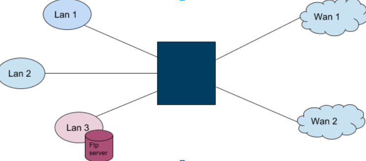
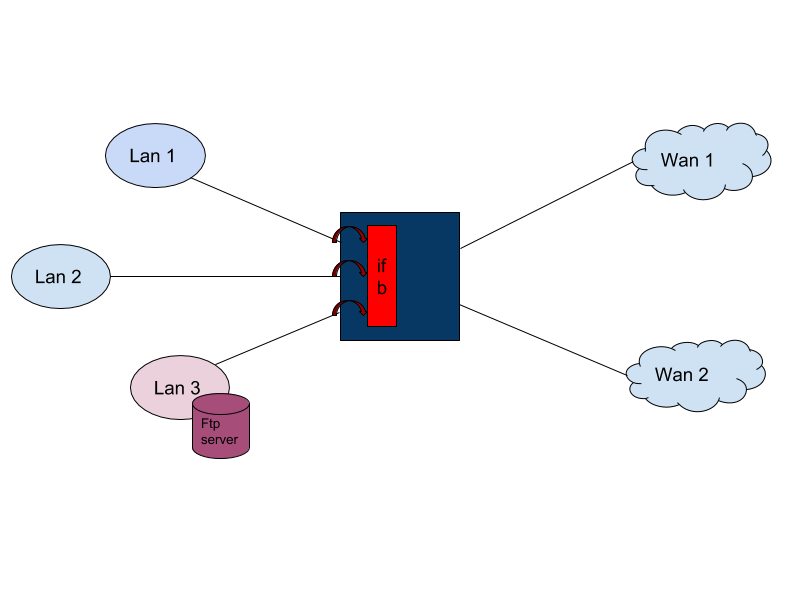
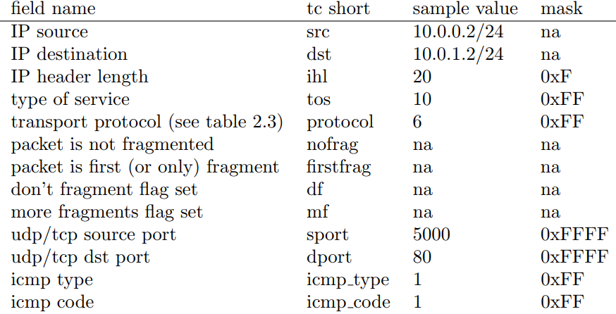
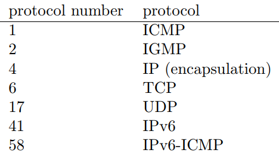

# senario

We have network like bellow picture. We want to apply this scenario on this network (in all of them we want per-IP shaping):

1. *source*: any, *destination*: any, *service*: remote-desktop, *outgoing-interface*:any  : download 600kbps , upload 600kbps
2. *source*: any, *destination*: any, *service*: FTP, *outgoing-interface*:any  : download 120kbps , upload 130kbps
3. *source*: user1 from lan1, *destination*: any, *service*: any, *outgoing-interface*: any  : download 500kbps , upload 200kbps
4. *source*: user2 from lan2, *destination*: any, *service*: any, *outgoing-interface*: any  : download 300kbps , upload 300kbps
5. *source*: users of lan1 , *destination*: any, *service*: tcp-4319, *outgoing-interface*: wan1  : download 80kbps , upload 130kbps
6. *source*: users of lan1 , *destination*: any, *service*: tcp-4319, *outgoing-interface*: wan2  : download 160kbps , upload 130kbps



# What we want?

we should have download and upload traffic shaping with priority. And don't forget we have NAT rules on our wan interfaces and ifb interface get the translated addresses.
We search and test lots of ideas and solutions, but every time we were faced with a problem. For example one solution was to shape upload traffic on wan interface and download traffic on lan interfaces, the problem was that if we have more than one wan interface this solution wouldn't help, because we couldn't detect traffic is coming from which wan interface.
Or using the solution that is described in below: 
like always for upload traffic shaping on wan interfaces we configure htb trees and filters on them. 
For download traffic shaping, we make an ifb interface that gets all egress traffic of lan interfaces(egress traffic of lan interfaces is equivalent to ingress traffic of wan interfaces and therefor we can make download traffic shaping tree on lan interfaces). For the problem of having more than one wan interface on download filters(that are configured on ifb interface) we specify the incoming interface('indev' parameter of u32 filter). "indev" of u32 filter is a big lie!! It doesn't work at all!!!

# Finally the solution
Finally we found the solution that is described bellow! 

## DOWNLOAD (WAN - LAN and LAN-LAN)
For download traffic shaping, we make an ifb interface that gets all egress traffic of lan interfaces(egress traffic of lan interfaces is equivalent to ingress traffic of wan interfaces and therefor we can make download traffic shaping tree on lan interfaces).

<pre>
tc qdisc add dev $LAN1  root handle 1111: htb
tc qdisc add dev $LAN2  root handle 2222: htb
tc qdisc add dev $LAN3  root handle 3333: htb
tc filter add dev $LAN1 parent 1111:  protocol ip  u32 match u32 0 0   action mirred egress redirect dev $IFB
tc filter add dev $LAN2 parent 2222:  protocol ip  u32 match u32 0 0   action mirred egress redirect dev $IFB
tc filter add dev $LAN3 parent 3333:  protocol ip  u32 match u32 0 0   action mirred egress redirect dev $IFB
</pre>


For the problem of having more than one wan interface on download filters(that are configured on ifb interface) we specify the incoming interface by mark incoming interface in iptables FORWARD chain of mangle table.

<pre>
iptables -t mangle -A FORWARD -t mangle -i $WAN1 -j MARK --set-mark $MW2
iptables -t mangle -A FORWARD -t mangle -i $WAN2 -j MARK --set-mark $MW1`
</pre>
For download shaping we should make download shaping tree on download ifb interface:

<pre>
tc qdisc add dev $IFB root handle 1:0 htb default 10
tc class add dev $IFB parent 1:0 classid 1:1 htb rate 4mbps ceil 4mbps 
tc class add dev $IFB parent 1:1 classid 1:10 htb rate 800kbps ceil 800kbps prio 2 #default class
tc class add dev $IFB parent 1:1 classid 1:11 htb rate 100kbps ceil 100kbps prio 2 
tc class add dev $IFB parent 1:1 classid 1:12 htb rate 500kbps ceil 500kbps prio 2 
tc class add dev $IFB parent 1:1 classid 1:13 htb rate 300kbps ceil 300kbps prio 2 
tc class add dev $IFB parent 1:1 classid 1:14 htb rate 120kbps ceil 120kbps prio 2 
tc class add dev $IFB parent 1:1 classid 1:15 htb rate 80kbps ceil 80kbps prio 2 
tc class add dev $IFB parent 1:1 classid 1:16 htb rate 160kbps ceil 160kbps prio 2 
tc class add dev $IFB parent 1:1 classid 1:17 htb rate 600kbps ceil 600kbps prio 1
</pre>


For guiding the download traffic to the correct class in ifb, we should use filters like bellow. By these two filters we can detect that the traffic is coming from which wan interface by their "mark"s (traffic that is coming from WAN1 has mark $MW1 and traffic that is coming from WAN2 has mark $MW2). In first filter we said send the TCP traffic (ip protocol 6) with source port 3389 that is coming from WAN1 to class 17 in ifb interface. In third filter we said send the UDP traffic (ip protocol 17) with source port 21 that is coming from WAN2 to class 14 in ifb interface. 

<pre>
tc filter add dev $IFB  protocol ip parent 1:0 prio 1 u32 match ip protocol 6 0xff match ip sport 3389 0xffff match mark $MW1 0xffff flowid 1:17
tc filter add dev $IFB  protocol ip parent 1:0 prio 2 u32 match ip protocol 6 0xff match ip sport 3389 0xffff match mark $MW2 0xffff flowid 1:17
tc filter add dev $IFB protocol ip parent 1:0 prio 5 u32 match ip protocol 17 0xff match ip sport 21 0xffff match mark $MW2 0xffff flowid 1:14
</pre>

For applying per-IP shaping, we use sfq qdisc with hash key based on destination ip. FYI, sfq qdisc divide the traffic in the qdisc based on a hash key that by default is based on session. We changed the default hash key setting(second line).

<pre>
tc qdisc add dev $IFB parent 1:10 handle 100: sfq perturb 10  divisor 1024
tc filter add dev $IFB parent 100: handle 100 protocol all prio 1  flow hash keys dst divisor 1024 baseclass 1:10
</pre>

For shaping the download traffic between two lans, we use the same solution that use for wan. Here the incoming interface is the lan interface that the source network is in it.

## UPLOAD  (WAN - LAN)
for shaping upload traffic of lan to wan we create the upload shaping tree on wan interfaces(outgoing interface).

<pre>
tc qdisc add dev $WAN1 root handle 1:0 htb default 10
tc class add dev $WAN1 parent 1:0 classid 1:1 htb rate 1mbps ceil 1mbps
tc class add dev $WAN1 parent 1:1 classid 1:10 htb rate 800kbps ceil 800kbps prio 2 #default class
tc class add dev $WAN1 parent 1:1 classid 1:11 htb rate 50kbps ceil 50kbps prio 2 
tc class add dev $WAN1 parent 1:1 classid 1:12 htb rate 200kbps ceil 200kbps prio 2
tc class add dev $WAN1 parent 1:1 classid 1:13 htb rate 300kbps ceil 300kbps prio 2 
tc class add dev $WAN1 parent 1:1 classid 1:14 htb rate 130kbps ceil 130kbps prio 2
tc class add dev $WAN1 parent 1:1 classid 1:15 htb rate 600kbps ceil 600kbps prio 1
</pre>

we use CONNMARK to mark connections (because of NAT) and use these marks in filters. 
the point is that the CONNMARKs should be before the interfaces marks for download shaping. 
the other point is that if the conditions of a shaping policy is only based on service and doesn't contain addressess we can shouldn't use CONNMARKs and filters are wrote based on the service (because we don't have NAT here!).

<pre>
iptables -t mangle -A FORWARD -j CONNMARK --restore-mark
iptables -t mangle -A FORWARD  -m mark --mark 0x0  -s $NET1 -j MARK --set-mark 0x1000
iptables -t mangle -A FORWARD -j CONNMARK --save-mark
</pre>

For upload we use nfct-src hash key for sfq qdiscs, this key works based on source address before NAT.

## UPLOAD (LAN-LAN)

For shaping upload traffic of one lan to another we should use ifb on outgoing interface, and send ingress traffic of that interface to it.

<pre>
tc qdisc add dev $LAN1  ingress handle ffff: 
tc filter add dev $LAN1 parent ffff:  protocol ip  u32 match u32 0 0   action mirred egress redirect dev ifb1
</pre>

filters applies on this ifb interface. (each LAN have its ifb for upload)
# sample code
<pre>
#! bin/bash
IFB=ifb0
WAN1=ETH4
WAN2=ETH2
LAN1=ETH0
LAN2=ETH1
LAN3=ETH3

NET1=192.168.150.0/24
NET2=192.168.160.0/24
NET3=40.40.40.0/24

USER1=192.168.150.2
USER2=192.168.160.2
USER3=40.40.40.41

MW1=104
MW2=102
ML2=201
echo "applying marks"
#################### marks #################################
iptables -t mangle -F

iptables -t mangle -A FORWARD -j CONNMARK --restore-mark
iptables -t mangle -A FORWARD -m mark --mark 0x0 -s $USER1 -j MARK --set-mark 0x1111
iptables -t mangle -A FORWARD -j CONNMARK --save-mark

iptables -t mangle -A FORWARD -j CONNMARK --restore-mark
iptables -t mangle -A FORWARD  -m mark --mark 0x0  -s $USER2 -j MARK --set-mark 0x2222
iptables -t mangle -A FORWARD -j CONNMARK --save-mark

iptables -t mangle -A FORWARD -j CONNMARK --restore-mark
iptables -t mangle -A FORWARD  -m mark --mark 0x0  -s $NET1 -p tcp --dport 3389 -j MARK --set-mark 0x1000
iptables -t mangle -A FORWARD  -m mark --mark 0x0  -s $NET1 -p udp --dport 3389 -j MARK --set-mark 0x1000
iptables -t mangle -A FORWARD -j CONNMARK --save-mark

iptables -t mangle -A FORWARD -j CONNMARK --restore-mark
iptables -t mangle -A FORWARD  -m mark --mark 0x0   -j MARK --set-mark 0x8888
iptables -t mangle -A FORWARD -j CONNMARK --save-mark

# important: LAN interfaces should not mark (as incomming interface) the packet, only WAN interfaces should mark.
iptables -t mangle -A FORWARD -t mangle -i ETH2 -j MARK --set-mark $MW2
iptables -t mangle -A FORWARD -t mangle -i ETH3 -j MARK --set-mark 103
iptables -t mangle -A FORWARD -t mangle -i ETH4 -j MARK --set-mark $MW1
iptables -t mangle -A FORWARD -t mangle -i ETH1 -j MARK --set-mark $ML2

################## delete existing qdiscs #####################
echo "modprobe ifb"
rmmod ifb
modprobe ifb numifbs=2
ifconfig ifb0 up
ifconfig ifb1 up
echo "delete root qdiscs"
tc qdisc del dev $LAN1 root
tc qdisc del dev $LAN2 root
tc qdisc del dev $LAN3 root
tc qdisc del dev $WAN1 root
tc qdisc del dev $WAN2 root
tc qdisc del dev $LAN1 ingress

echo "applying shaping trees"
################# The trick!:D ##############################
tc qdisc add dev $LAN1  root handle 1111: htb
tc qdisc add dev $LAN2  root handle 2222: htb
tc qdisc add dev $LAN3  root handle 3333: htb
tc filter add dev $LAN1 parent 1111:  protocol ip  u32 match u32 0 0   action mirred egress redirect dev $IFB
tc filter add dev $LAN2 parent 2222:  protocol ip  u32 match u32 0 0   action mirred egress redirect dev $IFB
tc filter add dev $LAN3 parent 3333:  protocol ip  u32 match u32 0 0   action mirred egress redirect dev $IFB

#LAN DOWNLOAD FROM LAN
tc qdisc add dev $LAN1  ingress handle ffff: 
tc filter add dev $LAN1 parent ffff:  protocol ip  u32 match u32 0 0   action mirred egress redirect dev ifb1


### ifb1 tree ####
tc qdisc add dev ifb1 root handle 1:0 htb default 10
tc class add dev ifb1 parent 1:0 classid 1:1 htb rate 500kbps ceil 500kbps
tc class add dev ifb1 parent 1:1 classid 1:10 htb rate 300kbps ceil 300kbps prio 2 #default class
tc class add dev ifb1 parent 1:1 classid 1:11 htb rate 100kbps ceil 100kbps prio 2 

tc qdisc add dev ifb1 parent 1:10 handle 100: sfq perturb 10  divisor 1024
tc qdisc add dev ifb1 parent 1:11 handle 101: sfq perturb 10  divisor 1024


################### download shaping tree ######################

tc qdisc add dev $IFB root handle 1:0 htb default 10
tc class add dev $IFB parent 1:0 classid 1:1 htb rate 4mbps ceil 4mbps #4mbps = sum of all wan interfaces download rate
tc class add dev $IFB parent 1:1 classid 1:10 htb rate 800kbps ceil 800kbps prio 2 #default class
tc class add dev $IFB parent 1:1 classid 1:11 htb rate 100kbps ceil 100kbps prio 2 #download all users
tc class add dev $IFB parent 1:1 classid 1:12 htb rate 500kbps ceil 500kbps prio 2 #download user1
tc class add dev $IFB parent 1:1 classid 1:13 htb rate 300kbps ceil 300kbps prio 2 #download user2
tc class add dev $IFB parent 1:1 classid 1:14 htb rate 120kbps ceil 120kbps prio 2 #download user3
tc class add dev $IFB parent 1:1 classid 1:15 htb rate 80kbps ceil 80kbps prio 2 #web lan1 (o=wan1)
tc class add dev $IFB parent 1:1 classid 1:16 htb rate 160kbps ceil 160kbps prio 2 #web lan1 (o=wan2)
tc class add dev $IFB parent 1:1 classid 1:17 htb rate 600kbps ceil 600kbps prio 1 #voip

################## wan1 upload shaping tree ####################
tc qdisc add dev $WAN1 root handle 1:0 htb default 10
tc class add dev $WAN1 parent 1:0 classid 1:1 htb rate 1mbps ceil 1mbps
tc class add dev $WAN1 parent 1:1 classid 1:10 htb rate 800kbps ceil 800kbps prio 2 #default class
tc class add dev $WAN1 parent 1:1 classid 1:11 htb rate 50kbps ceil 50kbps prio 2 #upload all users
tc class add dev $WAN1 parent 1:1 classid 1:12 htb rate 200kbps ceil 200kbps prio 2 #upload user1
tc class add dev $WAN1 parent 1:1 classid 1:13 htb rate 300kbps ceil 300kbps prio 2 #upload user2
tc class add dev $WAN1 parent 1:1 classid 1:14 htb rate 130kbps ceil 130kbps prio 2 #upload via net
tc class add dev $WAN1 parent 1:1 classid 1:15 htb rate 600kbps ceil 600kbps prio 1 #voip

################## wan2 upload shaping tree ####################
tc qdisc add dev $WAN2 root handle 1:0 htb default 10
tc class add dev $WAN2 parent 1:0 classid 1:1 htb rate 1mbps ceil 1mbps
tc class add dev $WAN2 parent 1:1 classid 1:10 htb rate 800kbps ceil 800kbps prio 2 #default class
tc class add dev $WAN2 parent 1:1 classid 1:11 htb rate 50kbps ceil 50kbps prio 2 #upload all users
tc class add dev $WAN2 parent 1:1 classid 1:12 htb rate 200kbps ceil 200kbps prio 2 #upload user1
tc class add dev $WAN2 parent 1:1 classid 1:13 htb rate 300kbps ceil 300kbps prio 2 #upload user2
tc class add dev $WAN2 parent 1:1 classid 1:14 htb rate 130kbps ceil 130kbps prio 2 #upload via net
tc class add dev $WAN2 parent 1:1 classid 1:15 htb rate 600kbps ceil 600kbps prio 1 #voip

echo "applying filters"

#################### filters #########################
#remote desktop
tc filter add dev $IFB  protocol ip parent 1:0 prio 1 u32 match ip protocol 6 0xff match ip sport 3389 0xffff match mark $MW1 0xffff flowid 1:17
tc filter add dev $IFB  protocol ip parent 1:0 prio 2 u32 match ip protocol 6 0xff match ip sport 3389 0xffff match mark $MW2 0xffff flowid 1:17
tc filter add dev $WAN1 protocol ip parent 1:0 prio 3 u32 match ip protocol 6 0xff match ip dport 3389 0xffff flowid 1:15
tc filter add dev $WAN2 protocol ip parent 1:0 prio 4 u32 match ip protocol 6 0xff match ip dport 3389 0xffff flowid 1:15
tc filter add dev $IFB  protocol ip parent 1:0 prio 1 u32 match ip protocol 17 0xff match ip sport 3389 0xffff match mark $MW1 0xffff flowid 1:17
tc filter add dev $IFB  protocol ip parent 1:0 prio 2 u32 match ip protocol 17 0xff match ip sport 3389 0xffff match mark $MW2 0xffff flowid 1:17
tc filter add dev $WAN1 protocol ip parent 1:0 prio 3 u32 match ip protocol 17 0xff match ip dport 3389 0xffff flowid 1:15
tc filter add dev $WAN2 protocol ip parent 1:0 prio 4 u32 match ip protocol 17 0xff match ip dport 3389 0xffff flowid 1:15
######for lans download
tc filter add dev $IFB protocol ip parent 1:0 prio 4 u32 match ip protocol 17 0xff match ip dport 3389 0xffff match mark $ML2 0xffff flowid 1:17
tc filter add dev $IFB protocol ip parent 1:0 prio 4 u32 match ip protocol 6  0xff match ip dport 3389 0xffff  match mark $ML2 0xffff flowid 1:17

#####for lan upload
tc filter add dev ifb1 protocol ip parent 1:0 prio 4 u32 match ip protocol 6  0xff match ip sport 3389 0xffff flowid 1:11
tc filter add dev ifb1 protocol ip parent 1:0 prio 4 u32 match ip protocol 17  0xff match ip sport 3389 0xffff flowid 1:11


#ftp
tc filter add dev $IFB protocol ip parent 1:0 prio 4 u32 match ip protocol 6 0xff match ip sport 445 0xffff match mark $MW1 0xffff flowid 1:14
tc filter add dev $IFB protocol ip parent 1:0 prio 4 u32 match ip protocol 6 0xff match ip sport 445 0xffff match mark $MW2 0xffff flowid 1:14
tc filter add dev $IFB protocol ip parent 1:0 prio 5 u32 match ip protocol 6 0xff match ip sport 21 0xffff match mark $MW1 0xffff flowid 1:14
tc filter add dev $IFB protocol ip parent 1:0 prio 5 u32 match ip protocol 6 0xff match ip sport 21 0xffff match mark $MW2 0xffff flowid 1:14
tc filter add dev $WAN1 protocol ip parent 1:0 prio 6 u32 match ip protocol 6 0xff match ip dport 21 0xffff flowid 1:14
tc filter add dev $WAN1 protocol ip parent 1:0 prio 7 u32 match ip protocol 6 0xff match ip dport 445 0xffff flowid 1:14
tc filter add dev $WAN2 protocol ip parent 1:0 prio 8 u32 match ip protocol 6 0xff match ip dport 21 0xffff flowid 1:14
tc filter add dev $WAN2 protocol ip parent 1:0 prio 9 u32 match ip protocol 6 0xff match ip dport 445 0xffff flowid 1:14
tc filter add dev $IFB protocol ip parent 1:0 prio 4 u32 match ip protocol 17 0xff match ip sport 445 0xffff match mark $MW1 0xffff flowid 1:14
tc filter add dev $IFB protocol ip parent 1:0 prio 4 u32 match ip protocol 17 0xff match ip sport 445 0xffff match mark $MW2 0xffff flowid 1:14
tc filter add dev $IFB protocol ip parent 1:0 prio 5 u32 match ip protocol 17 0xff match ip sport 21 0xffff match mark $MW1 0xffff flowid 1:14
tc filter add dev $IFB protocol ip parent 1:0 prio 5 u32 match ip protocol 17 0xff match ip sport 21 0xffff match mark $MW2 0xffff flowid 1:14
tc filter add dev $WAN1 protocol ip parent 1:0 prio 6 u32 match ip protocol 17 0xff match ip dport 21 0xffff flowid 1:14
tc filter add dev $WAN1 protocol ip parent 1:0 prio 7 u32 match ip protocol 17 0xff match ip dport 445 0xffff flowid 1:14
tc filter add dev $WAN2 protocol ip parent 1:0 prio 8 u32 match ip protocol 17 0xff match ip dport 21 0xffff flowid 1:14
tc filter add dev $WAN2 protocol ip parent 1:0 prio 9 u32 match ip protocol 17 0xff match ip dport 445 0xffff flowid 1:14

#download user1 from net1
tc filter add dev $IFB protocol ip parent 1:0 prio 10 u32 match ip dst $USER1 match mark $MW1 0xffff flowid 1:12
tc filter add dev $IFB protocol ip parent 1:0 prio 10 u32 match ip dst $USER1 match mark $MW2 0xffff flowid 1:12
#upload user1 from net1
tc filter add dev $WAN2 protocol ip parent 1:0 prio 12 u32 match mark 0x1111 0xffff flowid 1:12
tc filter add dev $WAN1 protocol ip parent 1:0 prio 12 u32 match mark 0x1111 0xffff flowid 1:12
#download user2 from net2
tc filter add dev $IFB protocol ip parent 1:0 prio 13 u32 match ip dst $USER2 match mark $MW1 0xffff flowid 1:13
tc filter add dev $IFB protocol ip parent 1:0 prio 14 u32 match ip dst $USER2 match mark $MW2 0xffff flowid 1:13
#upload user2 from net2
tc filter add dev $WAN1 protocol ip parent 1:0 prio 15 u32 match mark 0x2222 0xffff flowid 1:13
tc filter add dev $WAN2 protocol ip parent 1:0 prio 16 u32 match mark 0x2222 0xffff flowid 1:13
#Net1 tcp 80 o=wan1
tc filter add dev $IFB protocol ip parent 1:0 prio 17 u32 match ip dst $NET1 match ip protocol 6 0xff match ip sport 4319 0xffff match mark $MW1 0xffff flowid 1:15
tc filter add dev $WAN1 protocol ip parent 1:0 prio 17 u32 match ip protocol 6 0xff match ip dport 4319 0xffff match mark 0x1000 0xffff flowid 1:14
#Net1 tcp 80 o=wan2
tc filter add dev $IFB protocol ip parent 1:0 prio 18 u32 match ip dst $NET1 match mark $MW2 0xffff flowid 1:16
tc filter add dev $WAN2 protocol ip parent 1:0 prio 18 u32  match mark 0x1000 0xffff flowid 1:14
#download all users
tc filter add dev $IFB protocol ip parent 1:0 prio 19 u32 match ip dst $NET1 match mark $MW1 0xffff flowid 1:11
tc filter add dev $IFB protocol ip parent 1:0 prio 20 u32 match ip dst $NET2 match mark $MW1 0xffff flowid 1:11
tc filter add dev $IFB protocol ip parent 1:0 prio 21 u32 match ip dst $NET3 match mark $MW1 0xffff flowid 1:11
tc filter add dev $IFB protocol ip parent 1:0 prio 22 u32 match ip dst $NET1 match mark $MW2 0xffff flowid 1:11
tc filter add dev $IFB protocol ip parent 1:0 prio 23 u32 match ip dst $NET2 match mark $MW2 0xffff flowid 1:11
tc filter add dev $IFB protocol ip parent 1:0 prio 24 u32 match ip dst $NET3 match mark $MW2 0xffff flowid 1:11
#upload all users
tc filter add dev $WAN1 protocol ip parent 1:0 prio 25 u32 match ip src any match mark 0x8888 0xffff flowid 1:11
#tc filter add dev $WAN1 protocol ip parent 1:0 prio 26 u32 match ip src $NET2 flowid 1:11
#tc filter add dev $WAN1 protocol ip parent 1:0 prio 27 u32 match ip src $NET3 flowid 1:11
tc filter add dev $WAN2 protocol ip parent 1:0 prio 28 u32 match ip src any match mark 0x8888 0xffff flowid 1:11
#tc filter add dev $WAN2 protocol ip parent 1:0 prio 29 u32 match ip src $NET2 flowid 1:11
#tc filter add dev $WAN2 protocol ip parent 1:0 prio 30 u32 match ip src $NET3 flowid 1:11

#not important rules 
#download user3 from net3
tc filter add dev $IFB protocol ip parent 1:0 prio 31 u32 match ip dst $USER3 match mark $MW1 0xffff flowid 1:14
tc filter add dev $IFB protocol ip parent 1:0 prio 32 u32 match ip dst $USER3 match mark $MW2 0xffff flowid 1:14
#upload user3 from net3
tc filter add dev $WAN1 protocol ip parent 1:0 prio 33 u32 match ip src $USER3 flowid 1:14
tc filter add dev $WAN2 protocol ip parent 1:0 prio 34 u32 match ip src $USER3 flowid 1:14

echo "applying qdiscs"

#################### qdiscs ##########################

tc qdisc add dev $IFB parent 1:10 handle 100: sfq perturb 10  divisor 1024
tc qdisc add dev $IFB parent 1:11 handle 101: sfq perturb 10  divisor 1024
tc qdisc add dev $IFB parent 1:12 handle 102: sfq perturb 10  divisor 1024
tc qdisc add dev $IFB parent 1:13 handle 103: sfq perturb 10  divisor 1024
tc qdisc add dev $IFB parent 1:14 handle 104: sfq perturb 10  divisor 1024
tc qdisc add dev $IFB parent 1:15 handle 105: sfq perturb 10  divisor 1024
tc qdisc add dev $IFB parent 1:16 handle 106: sfq perturb 10  divisor 1024
tc qdisc add dev $IFB parent 1:17 handle 107: sfq perturb 10  divisor 1024

# Create 254 bucket, each ip src will be attached to one bucket
tc filter add dev $IFB parent 100: handle 100 protocol all prio 1  flow hash keys dst divisor 1024 baseclass 1:10
tc filter add dev $IFB parent 101: handle 101 protocol all prio 1  flow hash keys dst divisor 1024 baseclass 1:11
tc filter add dev $IFB parent 102: handle 102 protocol all prio 2  flow hash keys dst divisor 1024 baseclass 1:12
tc filter add dev $IFB parent 103: handle 103 protocol all prio 2  flow hash keys dst divisor 1024 baseclass 1:13
tc filter add dev $IFB parent 104: handle 104 protocol all prio 2  flow hash keys dst divisor 1024 baseclass 1:14
tc filter add dev $IFB parent 105: handle 105 protocol all prio 2  flow hash keys dst divisor 1024 baseclass 1:15
tc filter add dev $IFB parent 106: handle 106 protocol all prio 2  flow hash keys dst divisor 1024 baseclass 1:16
tc filter add dev $IFB parent 107: handle 107 protocol all prio 2  flow hash keys dst divisor 1024 baseclass 1:17

#################### qdiscs ##########################

tc qdisc add dev $WAN1 parent 1:10 handle 100: sfq perturb 10  divisor 1024
tc qdisc add dev $WAN1 parent 1:11 handle 101: sfq perturb 10  divisor 1024
tc qdisc add dev $WAN1 parent 1:12 handle 102: sfq perturb 10  divisor 1024
tc qdisc add dev $WAN1 parent 1:13 handle 103: sfq perturb 10  divisor 1024
tc qdisc add dev $WAN1 parent 1:14 handle 104: sfq perturb 10  divisor 1024
tc qdisc add dev $WAN1 parent 1:15 handle 105: sfq perturb 10  divisor 1024

# Create 254 bucket, each ip src will be attached to one bucket
tc filter add dev $WAN1 parent 100: handle 100 protocol all prio 1  flow hash keys nfct-src divisor 1024 baseclass 1:10
tc filter add dev $WAN1 parent 101: handle 101 protocol all prio 1  flow hash keys nfct-src divisor 1024 baseclass 1:11
tc filter add dev $WAN1 parent 102: handle 102 protocol all prio 2  flow hash keys nfct-src divisor 1024 baseclass 1:12
tc filter add dev $WAN1 parent 103: handle 103 protocol all prio 2  flow hash keys nfct-src divisor 1024 baseclass 1:13
tc filter add dev $WAN1 parent 104: handle 104 protocol all prio 2  flow hash keys nfct-src divisor 1024 baseclass 1:14
tc filter add dev $WAN1 parent 105: handle 105 protocol all prio 2  flow hash keys nfct-src divisor 1024 baseclass 1:15

#################### qdiscs ##########################

tc qdisc add dev $WAN2 parent 1:10 handle 100: sfq perturb 10  divisor 1024
tc qdisc add dev $WAN2 parent 1:11 handle 101: sfq perturb 10  divisor 1024
tc qdisc add dev $WAN2 parent 1:12 handle 102: sfq perturb 10  divisor 1024
tc qdisc add dev $WAN2 parent 1:13 handle 103: sfq perturb 10  divisor 1024
tc qdisc add dev $WAN2 parent 1:14 handle 104: sfq perturb 10  divisor 1024
tc qdisc add dev $WAN2 parent 1:15 handle 105: sfq perturb 10  divisor 1024

# Create 254 bucket, each ip src will be attached to one bucket
tc filter add dev $WAN2 parent 100: handle 100 protocol all prio 1  flow hash keys nfct-src divisor 1024 baseclass 1:10
tc filter add dev $WAN2 parent 101: handle 101 protocol all prio 1  flow hash keys nfct-src divisor 1024 baseclass 1:11
tc filter add dev $WAN2 parent 102: handle 102 protocol all prio 2  flow hash keys nfct-src divisor 1024 baseclass 1:12
tc filter add dev $WAN2 parent 103: handle 103 protocol all prio 2  flow hash keys nfct-src divisor 1024 baseclass 1:13
tc filter add dev $WAN2 parent 104: handle 104 protocol all prio 2  flow hash keys nfct-src divisor 1024 baseclass 1:14
tc filter add dev $WAN2 parent 105: handle 105 protocol all prio 2  flow hash keys nfct-src divisor 1024 baseclass 1:15


</pre>

# APPENDIX

## Filter
The filter commands can be divided into two groups: simple filters and complex filters. Simple filters are restricted in the way that they are referenced. Complex filters have identifier assigned and they have some more knowledge about the packets processed.

## simple filtering

**Add a filter:**
tc filter add dev DEV protocol PROTO parent ID prio PRIO FILTER match SELECTOR [FIELD] PATTERN MASK [at OFFSET] flowid FLOWID

**Delete filter:**
tc filter del DEV protocol PROTO parent ID prio PRIO

**Show filter:**
tc filter show dev DEV [protocol PROTO [parent ID [prio PRIO]]]

**DEV:** interface at which packets leave, e.g. eth1 

**PROTO:** protocol on which the filter must operate, e.g. ip, ipv6, arp, 802-3 , ...

**ID:** id of the class at which filtering should begin e.g. 1: to start at the root 

**PRIO:** determines the order in which filters are checked higher numbers → lower priority 
important: different protocols cannot have the same priority 

**FILTER:** specifies which filter is used, e.g. u32, fw , rvsp, route, tcindex.

**SELECTOR:** depends on the filter, e.g. for u32: u32, u16, u8, ip, ip6 

**FIELD:** name of the field to be compared only for ip and ip6 selector 

**PATTERN:** value of the specified field (decimal or hexadecimal) 

**MASK:** indicates which bits are compared 

**OFFSET:** start to compare at the location specified by PROTO + OFFSET bytes, only for uX selectors

**FLOWID:** references the class to which this filter is attached

## U32 filter

u32 filter -> according to arbitrary 32-bit fields in the packets, the starting position is indicated with OFFSET (in bytes) OFFSET must be a multiple of 4. A mask of the same length is used to indicate the bits that should match.

**ipv4 Traffic** 
Simple filters assume the ipv4 header length to be constant (without options). Therefore incorrect results may be found if these filters are used for fields belonging to layer 4 (e.g. udp, tcp etc). The complex filters solve this problem by inspecting the ihl (internet header length) field (see section 2.2.3. For ipv4 traffic (PROTO=ip, SELECTOR=ip) the following fields are predefined: 

  

protocol numbers are shown in bellow table, this numbers can found in /etc/protocols file.
  
 

**Example for destination port filtering:**

tc filter add dev eth1 parent 1: protocol ip prio 1 u32 match ip dport 5000 0xffff flowid 1:11

**Example for ip source address filtering:**

tc filter add dev eth1 parent 1: protocol ip prio 1 u32 match ip src 10.0.0.2 flowid 1:11

**Example for destination port filtering:**

tc filter add dev eth1 parent 1: protocol ipv6 prio 2 u32 match ip6 dport 5000 0xffff flowid 1:11

**Example for ip source address filtering:**

tc filter add dev eth1 parent 1: protocol ipv6 prio 2 u32 match ip6 src 2001:6a8:802:7::2 flowid 1:11

**To match the Ethernet destination address 12:34:56:78:9A:BC two filters must be concatenated in the following manner: **

tc filter add dev eth1 parent 1: protocol 802 3 prio 3 u32 match u32 0x12345678 0xffffffff at 0 match u32 0x9abc0000 0xffff0000 at 4 flowid 1:11

**To filter a packet according to its source ip address and its destination udp port the following statement can be used: ** 

(logical AND)

tc filter add dev eth1 protocol ip prio 1 u32 match ip protocol 17 0xff match ip dport 5000 0xffff match ip src 10.0.0.2 flowid 1:11

**All packets can be filtered based on destination ip address 10.0.0.2 and 10.0.1.2 to class 1:11 the following way:**

(logical OR)

tc filter add dev eth1 protocol ip prio 1 u32 match ip dst 10.0.0.2 flowid 1:11 
tc filter add dev eth1 protocol ip prio 1 u32 match ip dst 10.0.1.2 flowid 1:11

 **Remember**: different PRIO values must be used for different protocols!

**To filter for an address range the common notation can be used:**

tc filter add dev eth1 protocol ip prio 1 u32 match ip dst 10.0.1.0/24

**Filtering for a destination port range is done by adjusting the mask:**

(This matches every port between 49920 (0xC300) and 50175 (0xC3FF).)
tc filter add dev eth1 protocol ip prio 1 u32 match ip dport 50000 0xff00
		
## complex filtering (Hash filtering)

Complex Filter Commands Complex filters make use of user defined handles and hash tables. A hashtable contains slots and the slots contain filter rules. This allows us to specify exactly one filter rule. The hash table memorises which protocol is used (e.g. ip). This allows the evaluation of the ihl (internet header length) field to get the correct start location of the upper layer protocol. In this section only ip traffic and u32 filtering is considered. Before adding a filter rule some prearrangements have to be taken. 
read this manual for hash filtering:

[http://tcn.hypert.net/tcmanual.pdf]

**How Do I Monitor And Test Speed On Sever?**
Use the following tools
 /sbin/tc -s -d class show dev eth0
 /sbin/iptables -t mangle -n -v -L
 iptraf
 watch /sbin/tc -s -d class show dev eth0

To test download speed use lftop or wget command line tools.

# show rates of classes
```
echo 1 > /sys/module/sch_htb/parameters/htb_rate_est
```